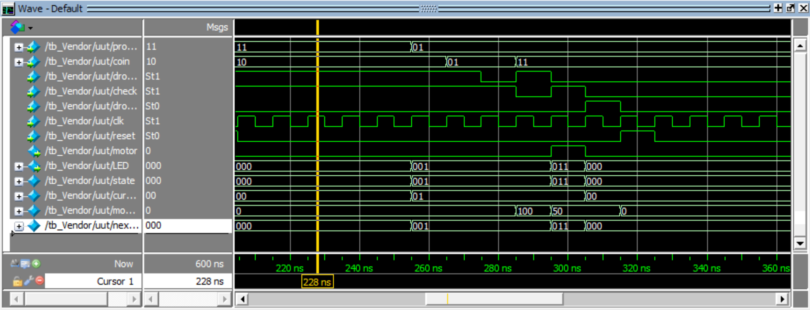

# Vendor machine

this project is a vending machine and the final project of logic circuit.

## state diagram

at first machine resets and starts at  `choose product` state.

when the product signal is changed, it goes to  `insert coin` stateand when the `drop_coin` signal is changed from 0 to 1, the machine sees the inserted coin and adds the amount of the coin to the user's money. 

When the `check` signal changes from 0 to 1 then the goes to the `evaluation` state and compares the user money and product price. if the money of the user is greater than the price of the product it subtracts the price from the money of the user so the user can use the money that remains in the next purchase, and the machine goes to  `deliver` state and otherwise goes to `error` state after seeing the posedge `check` goes to  `insert coin` state and wait for the user to insert more coin to machine. 

in `deliver` state  it turns the motor on until the `drop_product` signal changes from 1 to 0, and then turns the motor off and goes to  `choose product` state and ready for another operation.

## output table and transition table
| current state  | state code | LED | motor | next state             |
|----------------|------------|-----|-------|------------------------|
| choose product | 0          | 0   | 0     | insert coin            |
| insert coin    | 001        | 1   | 0     | evaluate , insert coin |
| evaluate       | 010        | 2   | 0     | error , deliver        |
| error          | 100        | 100 | 0     | insert coin            |
| deliver        | 011        | 011 | 1     | choose prouct          |

## implementation
```verilog
module Vendor(
    input [1:0] product,
    input [1:0] coin,
    input drop_coin,
    input reg check,
    input reg drop_product,
    input clk,
    input reset,
    output reg motor,
    output reg [2:0] LED
);

reg [2:0] state = 3'b000;
reg [1:0] cur_product;
reg [8:0] money = 0;
reg [2:0] next_state;
```

### inputs:
1. two bit product: shows the product the user choosed
2. two bit coin: shows the coin the user choosed
3. drop_coin: when coin inserted to the machine it becomes 1 for a short time and then becomes 0
4. check: when the user press check button it becomes 1 for a short time and then becomes 0
5. drop_product:when The product falls out of the machine becomes 1 for a short time and then becomes 0
6. clk
7. reset: when 1 resets the machine to state `choose product`

### outputs:
1. LED: shows the monitor situation
2. motor: shows the motor situation

### registers:
1. three bit state: shows the current state of the machine
2. two bit current product: shows the current product that the user selected.
3. eigth bit money: shows the amount of coin that the user inserted to the machine
4. three bit next state: shows the next state of the machine should goes to it.

## price of product and coins
| product 	| price 	|
|---------	|-------	|
| 0       	| 10    	|
| 1       	| 50    	|
| 2       	| 100   	|
| 3       	| 150   	|


| coin 	| price 	|
|------	|-------	|
| 0    	| 10    	|
| 1    	| 20    	|
| 2    	| 50    	|
| 3    	| 100   	|


### description:
It used a Behavioral coding style. This code has some always blocks and each of them is sensitive to a different signal and does a certain job. For example:
```verilog
always @(posedge drop_product) begin
    if (state == 3'b011) begin
        next_state <= 3'b000;
        motor = 0;
        LED = 0;
        cur_product = 0; 
    end
```
in this always block in ts checks if the machine is in the state `deliver` and `drop_product` signal changes from 0 to 1 it turns the motor off and the LED to 0 and resets the `cur_product` and puts `next_state` to 0.

or in this part
```verilog
always @(product) begin
    if (state == 3'b000) begin
        cur_product <= product;
        next_state <= 3'b001;
        LED <= 1;
        motor <= 0;
    end
end
```
when `product` signal changes it runs this always, if the machine is in the `choose product` state machine changes `cur_product` and `next_state` so the machine goes to the `insert coin` state and is ready for inserting coins and LED = 1.

## Test:
some tests were done on the code you can see all of them in [test bench](src/vendor_machine_tb.v), I explain 4 of them here, the rest of the tests are like these ones just the inputs vary in them.
### test 1:

at first the machine resets. LED = 000

at time t=10 the `product` signal changes so the `next state` and after it the `state` changes to 001, LED = 001

at time t=20 the `drop_coin` changes to 1 so the machine reads the `coin` signal and increases the money to 20.

at time t=35 the `drop_coin` again changes to 1 so the money increases to 40.

at time t=45 the `check` signal changes to 1 so the machine goes to the `evaluate` state. Because the money is greater than the product price, the money decreases to 30 and the machine goes to the `deliver` state, and the motor turns on. LED = 011

at time t=55 the `drop_product` signal changes to 1 so the motor turns off and the machine goes to the `choose products` state. LED =000

### test 2:

at time t=115 `product` signal changes to 11 to the machine goes to the `insert coin` state.

at time t = 125 the `drop_cion` signal changes to 1 so the machine reads the `coin` signal and increases the money to 80(the user has 30 cents from the last payment).

at time t=135 the `check` signal changes to 1 machine goes to the `evaluate` state but the user money is less than the price of the product so the machine goes to the `error` state and LED = 100.

at time t = 155 the `check` signal changes to 1 machine goes to the `insert coin` state again and the machine waits for the user to input more coins.

at time t=165 the `drop_coin` signal changes to 1 the machine reads the `coin` signal and the money increases to 180.
at time t=175 the `check` changes to 1 but this time user has enough money so the machine goes to the `deliver` state and the motor turns on.

at time t= 185 the `drop_product` signal changes to 1 so the machine goes to the `choose product` state and turns the motor off.

### test 3:

at first the machine resets. LED = 000

at time t=255 `product` signal changes so the `next state` and after it the `state` changes to 001, LED = 001

at time t=265 the `coin` signal changes but because the `drop_coin` signal doesn't change to 1, it doesn't increase the `coin` to the user money.

at time t=285 `drop_coin` again changes to 1 so the money increases to 100.

at time t=295 `check` signal changes to 1 so the machine goes to the `evaluate` state. Because the money is greater than the product price, the money decreases to 50 and the machine goes to the `deliver` state, and the motor turns on. LED = 011

at time t=305 `drop_product` signal changes to 1 so the motor turns off and the machine goes to the `choose products` state. LED =00
### test 4:

at first the machine resets. LED = 000

at time t=375 `product` signal changes so the `next state` and after it the `state` changes to 001, LED = 001

at time t=385 `drop_coin` again changes to 1 so the money increases to 50.

at time t=400 `drop_coin` again changes to 1 so the money increases to 100.

at time t=410 `check` signal changes to 1 so the machine goes to the `evaulate` state. Because the money is greater than the product price, the money decreases to 0 and the machine goes to the `deliver` state, and the motor turns on. LED = 011

at time t=420 `drop_product` signal changes to 1 so the motors turns off and the machine goes to the `choose products` state. LED =000.